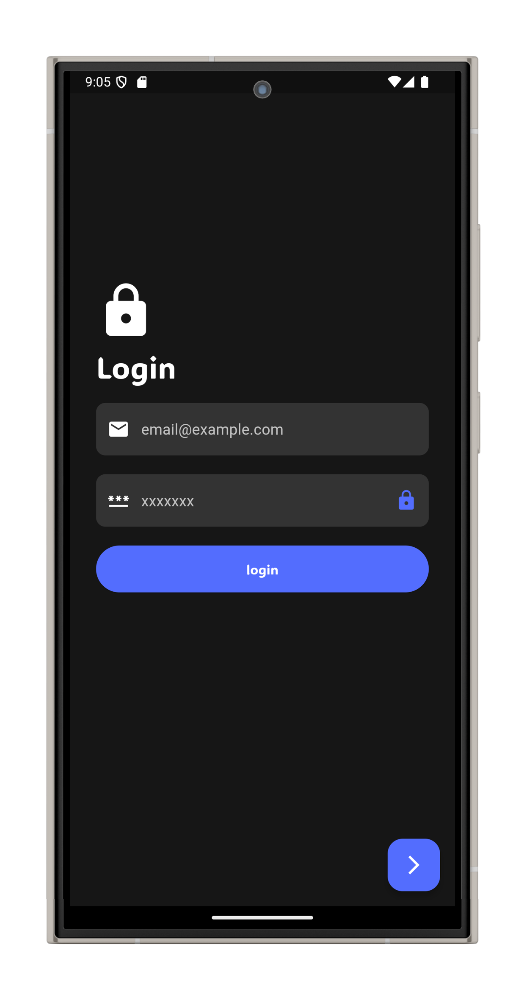
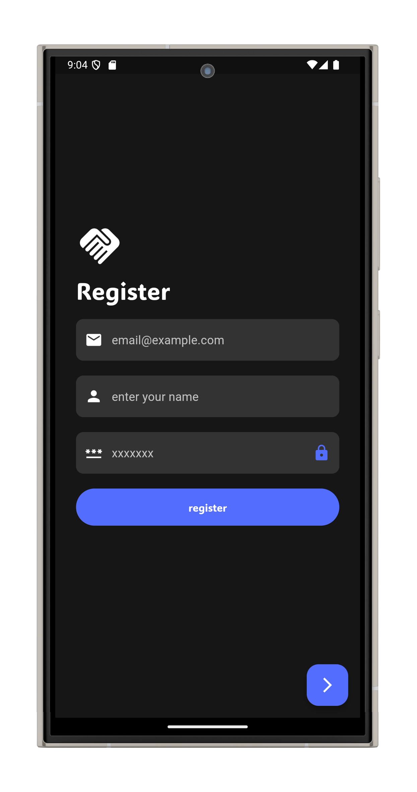
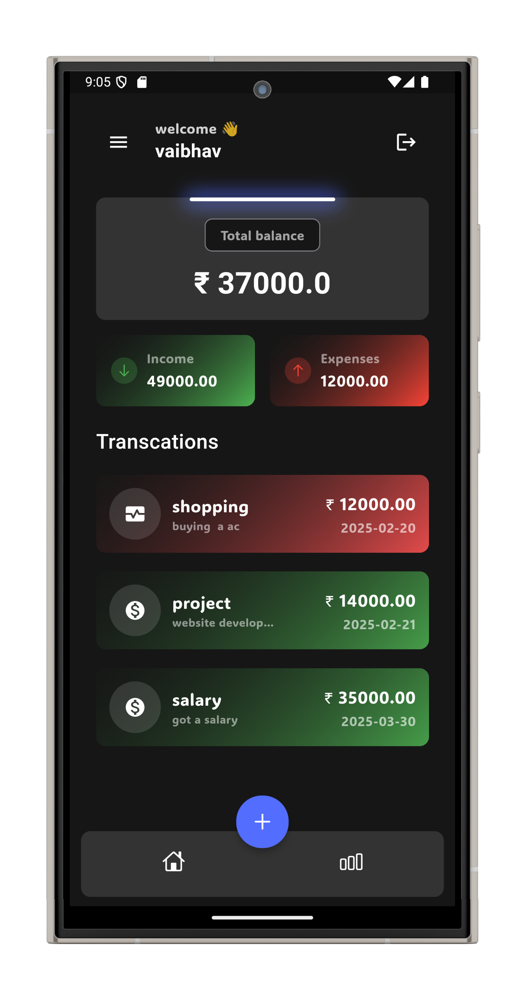
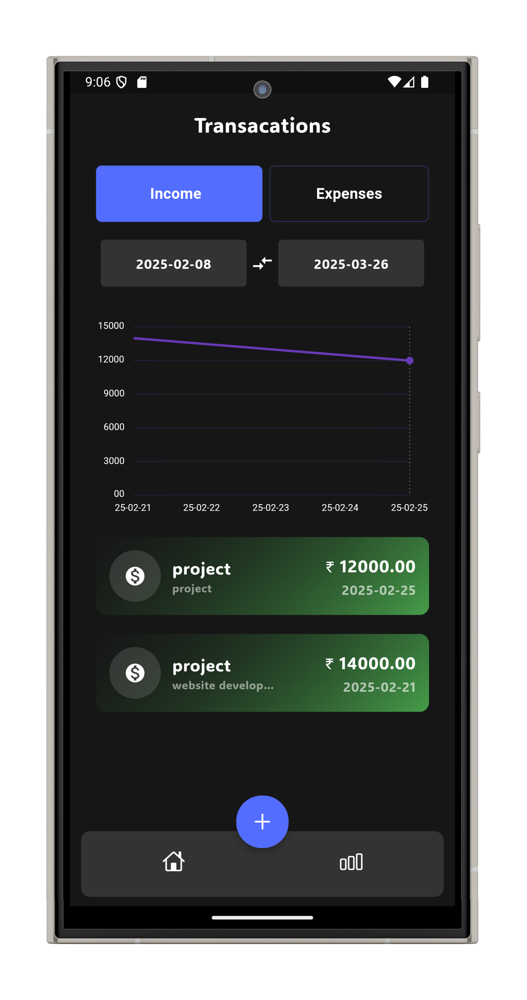
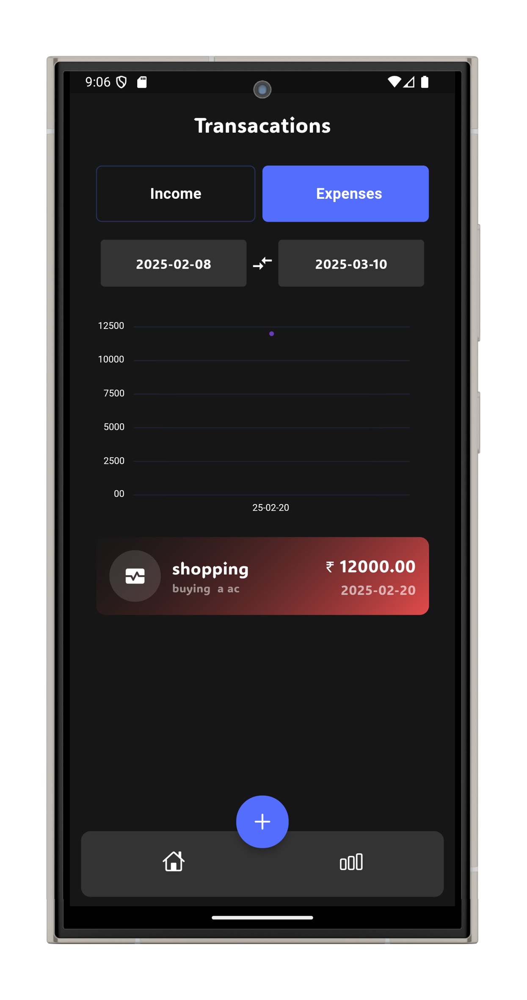

# Finance Tracker App

<!-- [Alternative Text](reference link) -->

## Instruction

- download the code.
- run the following command `flutter pub get`
- `flutter build apk --release` or `flutter build appbundle`
- `flutter install`

## Snapshots

